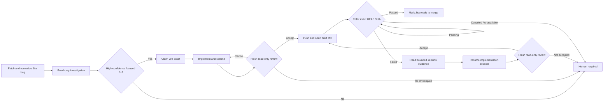

# Architecture

Bug Bot runs one durable Restate workflow for one Jira bug and repository.

## Owners

- [`workflow.ts`](../src/workflow/workflow.ts) owns sequencing, retries, irreversible actions, and terminal results.
- [`workflow.ts`](../src/workflow/workflow.ts) owns the deterministic confidence gate inline with workflow sequencing.
- [`local-git-workspaces.ts`](../src/integrations/git/local-git-workspaces.ts) owns repository isolation, path containment, Git execution, and cleanup.
- [`coding-harness.ts`](../src/coding/coding-harness.ts) defines the Codex/fake harness contract and structured results.
- The Jira and forge clients own their external boundaries. Forge access is exclusively through `gh` and `glab`.

## Invariants

- The repository URL must match a configured trusted prefix before cloning.
- Investigation and review use fresh read-only Codex sessions.
- Implementation and revision use the isolated workspace and never commit or push themselves.
- Git, not model output, is the source of truth for changed files.
- A patch must change at least one file, stay within the file limit, and report no validation failures.
- Review must accept before the branch is pushed and a draft merge request is opened. A CI-driven repair receives a new independent review before it is pushed.
- Forge status polling is commit-specific. Pending checks use durable Restate sleeps and do not consume the CI repair budget.
- Jira reaches `Ready to merge` only after the latest pushed commit has passed the configured CI check.
- Jenkins feedback is read only from the configured Jenkins base URL; the coding harness receives one bounded log excerpt and never accesses CI systems itself.
- The bot may assign, transition, link, commit, and push, but it never merges.
- Restate journals every external or non-deterministic operation so retries do not repeat completed work.

## Security

Repository paths are containment-checked, symlinks are rejected at workspace boundaries, and commands use argument arrays. Codex receives neither Jira, forge, nor Jenkins API credentials. Configure Restate request identity outside private local networks.
