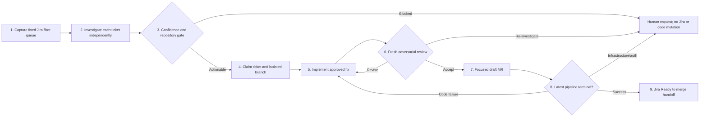
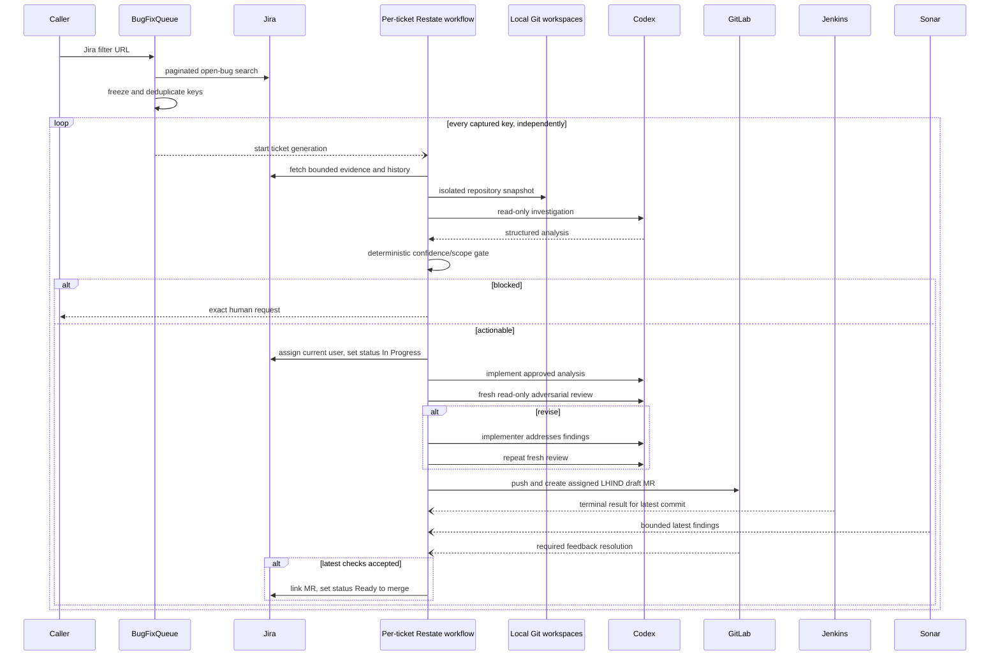

# Architecture

## Governing workflow

Bug Bot implements the nine-stage bugfix loop as Restate-owned orchestration. Deterministic code owns queue capture, gates, mutations, retries, correlation, and handoff. Codex invocations are bounded workers for investigation, implementation, CI repair, and independent review; they never receive Jira, GitLab, Jenkins, or SonarQube credentials.

The adversarial review runs before the first push and merge request. A material review revision creates a local commit and repeats a fresh review before publication. After publication, every CI repair creates a new push and resets pipeline observation; Jira handoff still requires successful terminal results for the latest commit.

## Naming boundaries

- A **Restate Service** is an SDK-registered `restate.service(...)` handler collection, such as `BugFixQueue` or a webhook ingress service.
- A **Restate Workflow** is the keyed durable `BugFixWorkflow` execution.
- A **journaled operation** is one external or non-deterministic action performed directly by a Restate workflow or service inside `ctx.run`.
- The **webhook API** is the public HTTP boundary on `APP_PORT`; it verifies the raw request and forwards the normalized command to Restate with the provider delivery ID as its idempotency key.

Restate ingress is an internal network dependency of that API and must not be exposed publicly in production. Each provider callback includes its delivery ID, workflow ID, repair attempt, and commit SHA; the workflow ignores stale callbacks before resolving its durable promise.

## Stage contracts

| Skill stage        | Owning component                                              | Enforced completion condition                                                                                                                                                                                                                                                                                             |
| ------------------ | ------------------------------------------------------------- | ------------------------------------------------------------------------------------------------------------------------------------------------------------------------------------------------------------------------------------------------------------------------------------------------------------------------- |
| 1. Load queue      | `BugFixQueue`                                                 | Jira pagination reaches its last page; keys are deduplicated into one immutable captured result before any workflow is dispatched.                                                                                                                                                                                        |
| 2. Investigate     | `CodingHarness.analyzeTask`                                   | One read-only, schema-constrained analysis exists per key with Jira, repository, reproduction, scope, complexity, missing information, and confidence. Workflows are dispatched independently, so one blocked ticket cannot stop another.                                                                                 |
| 3. Confidence gate | `applyConfidenceGate`                                         | The submitted repository URL matches a trusted deployment prefix; both confidences are High; files and observable verification are identified; and no information is missing. Otherwise no Jira/code mutation occurs.                                                                                                     |
| 4. Claim           | `JiraClient.claimIssue` and `LocalGitWorkspaces`              | The ticket is assigned to the authenticated Jira user, transitioned to In Progress, and has a unique `agent/<KEY>/<short-slug>` workspace.                                                                                                                                                                                |
| 5. Implement       | `BugFixWorkflow` and implementer harness                      | The approved analysis is supplied as a contract; only a bounded focused diff is accepted; validation succeeds; commit and push complete. Invalidated analysis stops rather than being forced through.                                                                                                                     |
| 6. Review          | fresh read-only `CodingHarness.review`                        | Before publication, the reviewer sees ticket evidence, analysis, complete base diff, and local verification. `Revise` returns findings to the implementer and requires another fresh review; `Re-investigate` stops.                                                                                                      |
| 7. MR              | forge client                                                  | A focused GitHub pull request or GitLab merge request targets the remote default branch, is assigned to the bot, carries `LHIND`, and has What/Why/How/Verification/Scope plus `Fixes <KEY>`.                                                                                                                             |
| 8. Pipeline        | `BugFixWorkflow` durable Jenkins/Sonar/GitLab-review promises | Every push waits for callbacks keyed to the current cycle. Stale commit callbacks are ignored. Code failures get the smallest bounded repair; infrastructure, authentication, repeated, exhausted, unclear, Sonar, and unresolved required-review failures require a human. Elapsed time is never interpreted as success. |
| 9. Handoff         | `BugFixWorkflow`                                              | Only an accepted latest state links the MR in Jira and transitions to Ready to merge. The bot never merges.                                                                                                                                                                                                               |

## System context

## Evidence and artifacts

Jira normalization includes summary, description, acceptance criteria, expected/actual behavior, reproduction steps, environment, affected versions, recent comments, links, attachment metadata/classification, and recent status history. Context is bounded before it reaches a harness. Each investigation writes `ticket-analysis/<KEY>/ANALYSIS.md`; blocked documents include the missing evidence and concrete human action.

The journaled investigation result remains a workflow-local value, so the implementer and fresh reviewer receive the same approved analysis contract during normal execution and replay. Workflow progression is owned directly by `workflow.ts`; it is not copied into a separate aggregate state object.

## Isolation, security, and durability

The bugfix workflow directly coordinates its coding harness and `LocalGitWorkspaces`, the two real execution boundaries. Its immutable input contains the forge and repository URL supplied by the caller. The URL must start with a trusted deployment prefix. Each ticket uses a deterministic unique clone path and focused branch, preserving unrelated work. Paths are containment-checked; commands use argument arrays; time, output, changed-file, and repair context are bounded. The Codex child has workspace-only or read-only access as appropriate and has Jira/forge credentials removed.

Restate journals queue capture and each external side effect. Workflow identity is `bugfix/<ISSUE-KEY>/<generation>`. Jenkins callbacks for older SHAs are ignored; every repair or review revision advances the callback cycle. A future Kubernetes executor must own both the workspace and coding runtime behind a new feature-local boundary; it must not recreate the deleted forwarding runner.

Authentication is an adapter concern. HTTP adapters use the authenticated service identity; an interactive Microsoft Entra deployment must translate an expired/missing session into a human-authentication request and resume the journaled operation after login. Product code must never be changed to conceal authentication or infrastructure failures.
