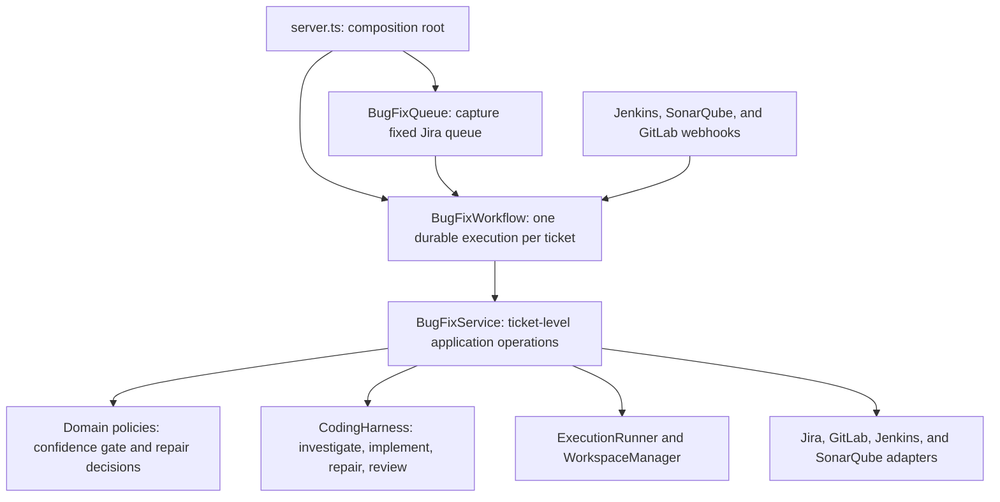

# Ticket Bot code tour

This document explains the runtime entry points, how Restate coordinates durable work, where Codex is used, and how the core workflow is separated from infrastructure.

## Runtime overview



The normal execution path is:

```text
Jira filter URL
  -> fixed queue capture
  -> one Restate workflow per ticket
  -> investigation and confidence gate
  -> Jira claim and focused branch
  -> implementation and adversarial review
  -> push and merge request
  -> Jenkins, SonarQube, and review callbacks
  -> Jira Ready to merge handoff
```

## Entry points

### Main server

[`src/server.ts`](../src/server.ts) is the primary runtime entry point and composition root. It:

- loads environment configuration;
- selects fake or HTTP Jira and GitLab adapters;
- selects the fake or Codex harness;
- creates the workspace manager and execution runner;
- constructs `BugFixService`;
- registers the queue workflow, per-ticket workflow, and webhook services;
- exposes the Restate endpoint through `Bun.serve`.

Use `bun run dev` during development or `bun run start` for the built application.

### Jira filter queue

[`src/workflows/bug-fix-queue.ts`](../src/workflows/bug-fix-queue.ts) exposes the `BugFixQueue` Restate service. Its `run` handler accepts:

```ts
{
  filterUrl: string;
  generation?: number;
}
```

[`BugFixQueueService`](../src/services/bug-fix-queue-service.ts) reads every Jira result page, deduplicates ticket keys, and returns a fixed queue. The Restate service then starts one independent `BugFixWorkflow` for each captured ticket.

The queue is captured once inside a journaled `ctx.run`. Tickets added to the Jira filter afterward are not silently appended to an active run.

### Single-ticket Jira webhook

[`src/webhooks/jira-webhook.ts`](../src/webhooks/jira-webhook.ts) is an alternative entry point for one eligible Jira bug. It validates the event and starts a ticket workflow directly rather than loading a filter queue.

### Optional MCP server

[`src/mcp/engineering-context-server.ts`](../src/mcp/engineering-context-server.ts) is a separate stdio program started with `bun run mcp`. It exposes bounded tools for related tickets, CI failures, changed-file quality findings, and merge-request context.

The MCP server is optional and is not called directly by the main workflow. Its default standalone provider returns empty or unavailable results until a deployment supplies a real `EngineeringContextProvider`.

## How Restate is used

The central integration is [`src/workflows/bug-fix-workflow.ts`](../src/workflows/bug-fix-workflow.ts). Restate supplies durable identity, state, side-effect journaling, and callback waits.

### Durable identity

Every ticket execution has a stable workflow ID:

```text
bug-fix/<ISSUE-KEY>/<generation>
```

For example:

```text
bug-fix/INV-123/1
```

The generation permits an intentional later run without confusing it with the original execution.

### Journaled operations

External or non-deterministic operations are wrapped with `ctx.run`:

```ts
await ctx.run("claim-jira-ticket", () => service.claimTicket(ticket.key), { maxRetryAttempts: 3 });
```

Restate records the operation result. After a process restart, completed steps can be replayed from the journal instead of being blindly executed again.

Journaled operations include:

- Jira reads, assignment, and transitions;
- repository workspace creation and branch activation;
- Codex investigation, implementation, repair, and review calls;
- validation and commits;
- branch pushes and merge-request creation;
- final Jira handoff.

Adapters should still make mutating requests idempotent where the remote API supports it. Restate protects workflow execution, but it cannot make a non-idempotent third-party endpoint transactional by itself.

### Durable state

The workflow restores and saves `BugFixWorkflowState` using `ctx.get` and `ctx.set`. The state contract is defined in [`src/domain/workflow.ts`](../src/domain/workflow.ts).

Durable state includes:

- workflow, ticket, and generation identifiers;
- repository, workspace, and branch identifiers;
- base and current commit SHAs;
- the approved ticket analysis;
- Codex session and token accounting;
- merge-request reference;
- repair and review attempt counts;
- compact failure fingerprints;
- current stage and human-readable status detail.

It does not store the full Codex conversation or unbounded Jira and CI payloads.

### Durable callback waits

The workflow waits for external systems through Restate promises:

```ts
await ctx.promise(`jenkins-${current.repairAttempt}`);
```

Webhook services later resolve the corresponding promise. The workflow can therefore wait across process restarts or deployments without polling in a continuously running application thread.

The shared workflow handlers are:

- `onJenkins`;
- `onSonarQube`;
- `onGitLabReview`;
- `status`.

Callbacks are correlated with the current repair cycle. Jenkins and GitLab callbacks for stale commit SHAs are ignored.

### Queue dispatch

The queue uses `workflowSendClient` to start every captured ticket without waiting for the previous ticket to finish. A blocked ticket therefore does not prevent unrelated workflows from progressing.

## How agent work is implemented

The project does not use the OpenAI Agents SDK. It defines a provider-neutral [`CodingHarness`](../src/domain/harness.ts) interface instead.

The harness operations are:

- `analyzeTask`: investigate in a read-only repository snapshot;
- `startTask`: implement an approved analysis;
- `continueTask`: repair a compact CI failure in the existing implementer session;
- `reviseTask`: address independent review findings;
- `review`: perform a fresh read-only adversarial review;
- `cancel`: stop a running session.

### Codex CLI adapter

[`src/harness/codex-harness.ts`](../src/harness/codex-harness.ts) implements `CodingHarness` by spawning the Codex CLI:

```text
codex exec ...
codex exec resume ...
```

Each invocation receives:

- a task-specific bounded prompt;
- read-only or workspace-write access as appropriate;
- a JSON output schema;
- a hard timeout;
- no Jira or GitLab credentials.

Investigation and review start fresh read-only sessions. Implementation repairs resume the implementer session so the agent receives only the compact new evidence required for that correction.

Prompts live in [`src/harness/harness-prompts.ts`](../src/harness/harness-prompts.ts). Structured output validation and JSON schemas live in [`src/harness/harness-result-parser.ts`](../src/harness/harness-result-parser.ts).

### Fake harness

[`src/harness/fake-codex-harness.ts`](../src/harness/fake-codex-harness.ts) implements the same interface without calling Codex. It supports deterministic local development and integration tests.

### MCP SDK

The dependency `@modelcontextprotocol/sdk` is used only by the optional engineering-context MCP server. It is a tool protocol SDK, not an agent orchestration SDK.

## Core workflow and application logic

The following files contain the behavior that defines the bug-fix process.

### Durable orchestration

[`src/workflows/bug-fix-workflow.ts`](../src/workflows/bug-fix-workflow.ts) owns ordering and durable state transitions. It decides when to investigate, gate, claim, review, publish, repair, wait, stop, or hand off.

This is the most important file for understanding the end-to-end behavior.

### Ticket-level application service

[`src/services/bug-fix-service.ts`](../src/services/bug-fix-service.ts) coordinates individual operations without depending on Restate. It:

- loads and normalizes Jira evidence;
- resolves the target repository;
- creates the investigation workspace;
- invokes the investigation harness;
- applies the confidence gate and writes `ANALYSIS.md`;
- claims the Jira ticket and activates the focused branch;
- invokes implementation and review;
- validates, commits, and pushes changes;
- creates the merge request;
- performs repair operations;
- transitions Jira to Ready to merge.

Keeping Restate out of this class makes the application behavior easier to test directly.

### Confidence policy

[`src/domain/analysis.ts`](../src/domain/analysis.ts) defines `TicketAnalysis`, renders the analysis document, and applies the deterministic gate. A ticket is actionable only when:

- root-cause confidence is High;
- proposed-fix confidence is High;
- affected files and observable verification are identified;
- no required information is missing;
- the resolved repository matches `ACTIONABLE_REPOSITORY_ID`.

### Repair policy

[`src/workflows/repair-policy.ts`](../src/workflows/repair-policy.ts) determines whether a Jenkins failure may trigger another code change. It stops for infrastructure failures, repeated unchanged failures, and exhausted repair limits.

### Domain contracts

The central data contracts are under [`src/domain`](../src/domain):

- `analysis.ts`: investigation and confidence gate;
- `ticket.ts`: normalized Jira evidence;
- `workflow.ts`: durable state and callbacks;
- `harness.ts`: agent task and result contracts;
- `ci.ts`: compact CI and Sonar evidence;
- `repository.ts`: repository configuration;
- `merge-request.ts`: merge-request contract;
- `errors.ts`: stable domain error categories.

## Infrastructure and replaceable adapters

Infrastructure performs I/O or supplies an execution mechanism. These components should be replaceable without changing confidence or workflow policy.

| Concern                                | Implementation                                                                            |
| -------------------------------------- | ----------------------------------------------------------------------------------------- |
| Jira HTTP API                          | [`src/integrations/jira/jira-client.ts`](../src/integrations/jira/jira-client.ts)         |
| Jira normalization                     | [`src/integrations/jira/jira-normalizer.ts`](../src/integrations/jira/jira-normalizer.ts) |
| GitLab HTTP API                        | [`src/integrations/gitlab/gitlab-client.ts`](../src/integrations/gitlab/gitlab-client.ts) |
| Jenkins client and log parsing         | [`src/integrations/jenkins`](../src/integrations/jenkins)                                 |
| SonarQube client and finding filtering | [`src/integrations/sonarqube`](../src/integrations/sonarqube)                             |
| Webhook validation and delivery        | [`src/webhooks`](../src/webhooks)                                                         |
| Runner abstraction                     | [`src/runner/execution-runner.ts`](../src/runner/execution-runner.ts)                     |
| Local runner                           | [`src/runner/local-runner.ts`](../src/runner/local-runner.ts)                             |
| Git workspace operations               | [`src/runner/workspace-manager.ts`](../src/runner/workspace-manager.ts)                   |
| Codex process adapter                  | [`src/harness/codex-harness.ts`](../src/harness/codex-harness.ts)                         |
| Environment configuration              | [`src/config/environment.ts`](../src/config/environment.ts)                               |
| Runtime composition                    | [`src/server.ts`](../src/server.ts)                                                       |

For example, moving execution from local processes to Kubernetes should require a new `ExecutionRunner`; it should not require changes to the confidence gate or repair policy.

## Error handling

Error handling is split between domain classification, workflow policy, Restate retries, and adapter mechanics.

### Stable error categories

[`src/domain/errors.ts`](../src/domain/errors.ts) defines `DomainError` codes such as:

- `HARNESS_TIMEOUT`;
- `HARNESS_BLOCKED`;
- `HUMAN_INPUT_REQUIRED`;
- `VALIDATION_FAILURE`;
- `CI_INFRASTRUCTURE_FAILURE`;
- `REPAIR_LIMIT_REACHED`;
- `REPEATED_FAILURE`;
- `PUSH_FAILURE`.

These codes let the workflow distinguish a ticket that needs human action from an unexpected application failure.

### Workflow outcome mapping

The catch block in `BugFixWorkflow.run` maps known intervention conditions to `HUMAN_REQUIRED`. Unexpected or non-recoverable failures become `FAILED`.

### Restate retries

Individual `ctx.run` operations specify bounded retry counts. Restate owns durable retry execution; the domain policy owns whether continuing is semantically allowed.

### Adapter protections

Adapters and runners supply lower-level protections such as:

- HTTP timeouts;
- child-process timeouts;
- bounded stdout and stderr buffers;
- workspace path containment;
- stale callback rejection;
- changed-file limits;
- output-schema validation.

## Telemetry and observability

Telemetry is currently a lightweight extension seam rather than a complete production observability implementation.

[`src/telemetry/token-usage.ts`](../src/telemetry/token-usage.ts) converts workflow token totals into metric attributes for:

- initial implementation;
- repairs and revisions;
- independent review;
- total usage.

[`src/telemetry/workflow-metrics.ts`](../src/telemetry/workflow-metrics.ts) defines:

- a JSON structured logger;
- a `TelemetryHooks` interface for stage durations;
- a no-op default implementation.

Token totals are already retained in durable workflow state. OpenTelemetry exporters, systematic stage-duration calls, traces, dashboards, and alerting are not yet wired into the runtime. Those are infrastructure additions and should not change workflow decisions.

## Testing boundaries

The test suite reflects the architectural boundaries:

- [`test/bug-fix-queue.test.ts`](../test/bug-fix-queue.test.ts): fixed paginated queue capture;
- [`test/confidence-gate.test.ts`](../test/confidence-gate.test.ts): deterministic actionability rules;
- [`test/repair-policy.test.ts`](../test/repair-policy.test.ts): CI repair decisions;
- [`test/harness-result-parser.test.ts`](../test/harness-result-parser.test.ts): structured agent output validation;
- [`test/vertical-slice.integration.test.ts`](../test/vertical-slice.integration.test.ts): Jira normalization through isolated Git branch, review, push, and draft MR;
- [`test/webhook-validation.test.ts`](../test/webhook-validation.test.ts): ingress validation and payload limits.

Run the complete verification suite with:

```bash
bun run check
```

## Where to start reading

For a first pass through the code, use this order:

1. [`src/server.ts`](../src/server.ts) — see how the application is assembled.
2. [`src/workflows/bug-fix-queue.ts`](../src/workflows/bug-fix-queue.ts) — see how filter runs fan out.
3. [`src/workflows/bug-fix-workflow.ts`](../src/workflows/bug-fix-workflow.ts) — follow the durable ticket lifecycle.
4. [`src/services/bug-fix-service.ts`](../src/services/bug-fix-service.ts) — inspect each ticket operation.
5. [`src/domain/analysis.ts`](../src/domain/analysis.ts) and [`src/workflows/repair-policy.ts`](../src/workflows/repair-policy.ts) — understand deterministic policy.
6. [`src/domain/harness.ts`](../src/domain/harness.ts) and [`src/harness/codex-harness.ts`](../src/harness/codex-harness.ts) — understand the agent boundary.
7. [`src/runner/workspace-manager.ts`](../src/runner/workspace-manager.ts) and [`src/integrations`](../src/integrations) — inspect execution and external-system infrastructure.

For the workflow requirements and stage invariants, also see [`docs/architecture.md`](./architecture.md).
