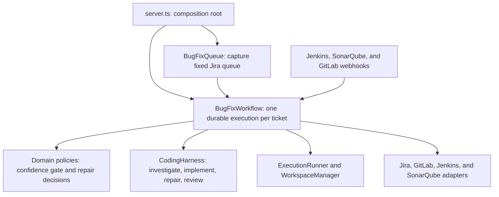

# Bug Bot code tour

This document explains the runtime entry points, how Restate coordinates durable work, where Codex is used, and how the core workflow is separated from infrastructure.

## Runtime overview



The normal execution path is:

```text
Jira filter URL
  -> fixed queue capture
  -> one Restate workflow per ticket
  -> investigation and confidence gate
  -> Jira claim and focused branch
  -> implementation and adversarial review
  -> push and merge request
  -> Jenkins, SonarQube, and review callbacks
  -> Jira Ready to merge handoff
```

## Entry points

### Main server

[`src/app/server.ts`](../src/app/server.ts) is the primary runtime entry point and composition root. It:

- loads environment configuration;
- selects fake or HTTP Jira and GitLab adapters;
- selects the fake or Codex harness;
- creates the local Git workspace boundary;
- supplies the workflow's concrete dependencies;
- registers the queue workflow, per-ticket workflow, and webhook services;
- registers the Restate endpoint with `restate.serve` and exposes the public webhook API through `Bun.serve`.

Use `bun run dev` during development or `bun run start` for the built application.

### Jira filter queue

[`src/features/bugfix/bugfix-queue.restate-service.ts`](../src/features/bugfix/bugfix-queue.restate-service.ts) exposes the `BugFixQueue` Restate service. Its `run` handler accepts:

```ts
{
  filterUrl: string;
  generation?: number;
}
```

The service reads every Jira result page, deduplicates ticket keys, and returns a fixed queue before starting one independent `BugFixWorkflow` per ticket.

The queue is captured once inside a journaled `ctx.run`. Tickets added to the Jira filter afterward are not silently appended to an active run.

### Single-ticket Jira webhook

[`src/features/bugfix/ingress/jira-webhook.restate-service.ts`](../src/features/bugfix/ingress/jira-webhook.restate-service.ts) is an alternative entry point for one eligible Jira bug. It validates the event and starts a ticket workflow directly rather than loading a filter queue.

### Optional MCP server

[`src/mcp/engineering-context-server.ts`](../src/mcp/engineering-context-server.ts) is a separate stdio program started with `bun run mcp`. It exposes bounded tools for related tickets, CI failures, changed-file quality findings, and merge-request context.

The MCP server is optional and is not called directly by the main workflow. Its default standalone provider returns empty or unavailable results until a deployment supplies a real `EngineeringContextProvider`.

## How Restate is used

The central integration is [`src/features/bugfix/bugfix.restate-workflow.ts`](../src/features/bugfix/bugfix.restate-workflow.ts). It is the single owner of the sequential ticket lifecycle: state, journaled operations, callback waits, repair policy, and terminal outcomes.

### Durable identity

Every ticket execution has a stable workflow ID:

```text
bugfix/<ISSUE-KEY>/<generation>
```

For example:

```text
bugfix/INV-123/1
```

The generation permits an intentional later run without confusing it with the original execution.

### Journaled operations

External or non-deterministic operations are wrapped with `ctx.run`:

```ts
await ctx.run("claim-jira-ticket", () => service.claimTicket(ticket.key), { maxRetryAttempts: 3 });
```

Restate records the operation result. After a process restart, completed steps can be replayed from the journal instead of being blindly executed again.

Journaled operations include:

- Jira reads, assignment, and transitions;
- repository workspace creation and branch activation;
- Codex investigation, implementation, repair, and review calls;
- validation and commits;
- branch pushes and merge-request creation;
- final Jira handoff.

Adapters should still make mutating requests idempotent where the remote API supports it. Restate protects workflow execution, but it cannot make a non-idempotent third-party endpoint transactional by itself.

### Durable state

The workflow restores and saves `BugFixWorkflowState` using `ctx.get` and `ctx.set`. The state contract is defined in [`src/features/bugfix/workflow-state.ts`](../src/features/bugfix/workflow-state.ts).

Durable state includes:

- workflow, ticket, and generation identifiers;
- repository, workspace, and branch identifiers;
- base and current commit SHAs;
- the approved ticket analysis;
- Codex session;
- merge-request reference;
- repair and review attempt counts;
- compact failure fingerprints;
- current stage and human-readable status detail.

It does not store the full Codex conversation or unbounded Jira and CI payloads.

### Durable callback waits

The workflow waits for external systems through Restate promises:

```ts
await ctx.promise(`jenkins-${current.repairAttempt}`);
```

Webhook services later resolve the corresponding promise. The workflow can therefore wait across process restarts or deployments without polling in a continuously running application thread.

The shared workflow handlers are:

- `onJenkins`;
- `onSonarQube`;
- `onGitLabReview`;
- `status`.

Callbacks are correlated with the current repair cycle. Jenkins and GitLab callbacks for stale commit SHAs are ignored.

### Queue dispatch

The queue uses `workflowSendClient` to start every captured ticket without waiting for the previous ticket to finish. A blocked ticket therefore does not prevent unrelated workflows from progressing.

## How agent work is implemented

The project does not use the OpenAI Agents SDK. It defines a provider-neutral [`CodingHarness`](../src/features/bugfix/coding/coding-harness.ts) interface instead.

The harness operations are:

- `analyzeTask`: investigate in a read-only repository snapshot;
- `startTask`: implement an approved analysis;
- `continueTask`: repair a compact CI failure in the existing implementer session;
- `reviseTask`: address independent review findings;
- `review`: perform a fresh read-only adversarial review;

### Codex SDK adapter

[`src/features/bugfix/coding/codex-coding-harness.ts`](../src/features/bugfix/coding/codex-coding-harness.ts) implements `CodingHarness` through the official `@openai/codex-sdk`. The SDK manages local Codex threads and the adapter uses its typed start, resume, and structured-output APIs.

Each invocation receives:

- a task-specific bounded prompt;
- read-only or workspace-write access as appropriate;
- a JSON output schema;
- a hard timeout;
- no Jira or GitLab credentials in the Codex runtime environment.

Investigation and review start fresh read-only sessions. Implementation repairs resume the implementer session so the agent receives only the compact new evidence required for that correction.

Prompts live in [`src/features/bugfix/coding/codex-prompts.ts`](../src/features/bugfix/coding/codex-prompts.ts). Structured output validation and JSON schemas live in [`src/features/bugfix/coding/codex-result-parser.ts`](../src/features/bugfix/coding/codex-result-parser.ts).

### Fake harness

[`src/features/bugfix/coding/fake-coding-harness.ts`](../src/features/bugfix/coding/fake-coding-harness.ts) implements the same interface without calling an external coding provider. It supports deterministic local development and integration tests.

### MCP SDK

The dependency `@modelcontextprotocol/sdk` is used only by the optional engineering-context MCP server. It is a tool protocol SDK, not an agent orchestration SDK.

## Core workflow and application logic

The following files contain the behavior that defines the bugfix process.

### Durable orchestration

[`src/workflows/bugfix/workflow.ts`](../src/workflows/bugfix/workflow.ts) owns the complete durable lifecycle. Its `run` handler reads as a sequence of ticket loading, investigation, gating, implementation, review, publication, and handoff steps. Cohesive operation details live under [`src/workflows/bugfix/tasks`](../src/workflows/bugfix/tasks), while the workflow keeps journal boundaries, retries, and decisions visible.

This is the most important file for understanding the end-to-end behavior.

### Confidence policy

[`src/domain/ticket-analysis.ts`](../src/domain/ticket-analysis.ts) defines `TicketAnalysis`; [`src/workflows/bugfix/tasks/analysis.ts`](../src/workflows/bugfix/tasks/analysis.ts) renders the analysis document and applies the deterministic gate. A ticket is actionable only when:

- root-cause confidence is High;
- proposed-fix confidence is High;
- affected files and observable verification are identified;
- no required information is missing;
- the resolved repository matches `ACTIONABLE_REPOSITORY_ID`.

### Repair policy

[`src/workflows/bugfix/tasks/repair-policy.ts`](../src/workflows/bugfix/tasks/repair-policy.ts) determines whether a Jenkins failure may trigger another code change. It stops for infrastructure failures, repeated unchanged failures, and exhausted repair limits.

### Domain contracts

The bugfix data contracts are under [`src/features/bugfix`](../src/features/bugfix):

- `ticket-analysis.ts`: investigation result contract;
- `ticket.ts`: normalized Jira evidence;
- `workflow-state.ts`: durable state and callbacks;
- `coding/coding-harness.ts`: agent task and result contracts;
- `ci.ts`: compact CI and Sonar evidence;
- `repository.ts`: repository configuration;
- `merge-request.ts`: merge-request contract;
- `errors.ts`: stable domain error categories.

## Infrastructure and replaceable adapters

Infrastructure performs I/O or supplies an execution mechanism. These components should be replaceable without changing confidence or workflow policy.

| Concern                                | Implementation                                                                                                      |
| -------------------------------------- | ------------------------------------------------------------------------------------------------------------------- |
| Jira HTTP API                          | [`src/integrations/jira/jira-client.ts`](../src/integrations/jira/jira-client.ts)                                   |
| Jira normalization                     | [`src/integrations/jira/jira-normalizer.ts`](../src/integrations/jira/jira-normalizer.ts)                           |
| GitLab HTTP API                        | [`src/integrations/gitlab/gitlab-client.ts`](../src/integrations/gitlab/gitlab-client.ts)                           |
| Jenkins client and log parsing         | [`src/integrations/jenkins`](../src/integrations/jenkins)                                                           |
| SonarQube client and finding filtering | [`src/integrations/sonarqube`](../src/integrations/sonarqube)                                                       |
| Webhook validation and delivery        | [`src/features/bugfix/ingress`](../src/features/bugfix/ingress)                                                     |
| Git workspace operations               | [`src/features/bugfix/workspace/local-git-workspaces.ts`](../src/features/bugfix/workspace/local-git-workspaces.ts) |
| Codex process adapter                  | [`src/features/bugfix/coding/codex-coding-harness.ts`](../src/features/bugfix/coding/codex-coding-harness.ts)       |
| Environment configuration              | [`src/app/environment.ts`](../src/app/environment.ts)                                                               |
| Runtime composition                    | [`src/app/server.ts`](../src/app/server.ts)                                                                         |

A future Kubernetes executor should own both its workspace and coding runtime behind a feature-local boundary; it should not require changes to the confidence gate or repair policy.

## Error handling

Error handling is split between workflow policy, Restate failure handling, and adapter mechanics.

### Stable error categories

Non-retryable workflow and integration failures use Restate `TerminalError` directly.

- `HARNESS_TIMEOUT`;
- `HARNESS_BLOCKED`;
- `HUMAN_INPUT_REQUIRED`;
- `VALIDATION_FAILURE`;
- `CI_INFRASTRUCTURE_FAILURE`;
- `REPAIR_LIMIT_REACHED`;
- `REPEATED_FAILURE`;
- `PUSH_FAILURE`.

These categories document why an operation can fail; they are not converted into a successful workflow result.

### Workflow outcomes

Domain decisions that deliberately stop automation return `HUMAN_REQUIRED` with a concrete reason. The workflow does not catch operational failures: `TerminalError` permanently fails the invocation, while retryable errors remain under Restate's retry policy.

### Restate retries

Individual `ctx.run` operations specify bounded retry counts. Restate owns durable retry execution; the domain policy owns whether continuing is semantically allowed.

### Adapter protections

Adapters and runners supply lower-level protections such as:

- HTTP timeouts;
- child-process timeouts;
- bounded stdout and stderr buffers;
- workspace path containment;
- stale callback rejection;
- changed-file limits;
- output-schema validation.

## Testing boundaries

The test suite reflects the architectural boundaries:

- [`test/bugfix-queue.test.ts`](../test/bugfix-queue.test.ts): fixed paginated queue capture;
- [`test/confidence-gate.test.ts`](../test/confidence-gate.test.ts): deterministic actionability rules;
- [`test/repair-policy.test.ts`](../test/repair-policy.test.ts): CI repair decisions;
- [`test/harness-result-parser.test.ts`](../test/harness-result-parser.test.ts): structured agent output validation;
- [`test/restate-replay.integration.test.ts`](../test/restate-replay.integration.test.ts): queue and workflow behavior under Restate's always-replay mode;
- [`test/webhook-validation.test.ts`](../test/webhook-validation.test.ts): ingress validation and payload limits.

Run the complete verification suite with:

```bash
bun run check
```

## Where to start reading

For a first pass through the code, use this order:

1. [`src/app/server.ts`](../src/app/server.ts) — see how the application is assembled.
2. [`src/features/bugfix/bugfix-queue.restate-service.ts`](../src/features/bugfix/bugfix-queue.restate-service.ts) — see how filter runs fan out.
3. [`src/workflows/bugfix/workflow.ts`](../src/workflows/bugfix/workflow.ts) — follow the complete sequential lifecycle.
4. [`src/workflows/bugfix/tasks`](../src/workflows/bugfix/tasks), [`src/domain/ticket-analysis.ts`](../src/domain/ticket-analysis.ts), and [`src/workflows/bugfix/workflow-state.ts`](../src/workflows/bugfix/workflow-state.ts) — understand operation details, deterministic policy, the analysis contract, and durable state.
5. [`src/features/bugfix/coding/coding-harness.ts`](../src/features/bugfix/coding/coding-harness.ts) and [`src/features/bugfix/coding/codex-coding-harness.ts`](../src/features/bugfix/coding/codex-coding-harness.ts) — understand the agent boundary.
6. [`src/features/bugfix/workspace/local-git-workspaces.ts`](../src/features/bugfix/workspace/local-git-workspaces.ts) and [`src/integrations`](../src/integrations) — inspect execution and external-system infrastructure.

For the workflow requirements and stage invariants, also see [`docs/architecture.md`](./architecture.md).
