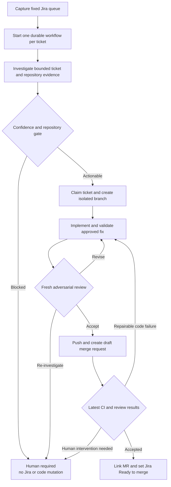

# Reading guide

This is the shortest path to understanding Ticket Bot. Read it lifecycle-first: begin with what the system does, then follow one ticket through durable orchestration, domain policy, agent execution, and external adapters. For deeper detail, see [architecture.md](architecture.md) and [code-tour.md](code-tour.md).

## Business lifecycle

Ticket Bot turns a captured Jira bug into a reviewed draft merge request that is ready for a human to merge:

1. Capture and freeze the issues returned by a Jira filter.
2. Start one durable workflow per ticket so tickets progress independently.
3. Gather bounded Jira and repository evidence, then ask the coding harness to investigate.
4. Apply a deterministic confidence and repository gate. Unclear or out-of-scope work stops with a concrete human request and no mutation.
5. Claim an actionable ticket, create an isolated workspace and focused branch, implement the approved analysis, and validate the change.
6. Run a fresh adversarial review. Material findings return to implementation and require another review.
7. Push the accepted change and create a focused draft merge request.
8. Wait durably for Jenkins, SonarQube, and GitLab review results for the latest commit. Eligible code failures receive bounded repair attempts; infrastructure, authentication, repeated, exhausted, or unclear failures require a human.
9. When the latest checks are accepted, link the merge request in Jira and move the ticket to Ready to merge. The bot never merges it.

## Canonical file reading order

Follow this order for an end-to-end mental model. On a first pass, read public types and top-level methods before implementation details.

1. [`src/app/server.ts`](../src/app/server.ts) — composition root: which concrete services, adapters, workflows, and webhooks make up the application.
2. [`src/entrypoints/bugfix-queue.restate-service.ts`](../src/entrypoints/bugfix-queue.restate-service.ts) — how a Jira filter becomes one immutable, deduplicated batch of independent ticket workflows.
3. [`src/workflows/bugfix/workflow.ts`](../src/workflows/bugfix/workflow.ts) — the canonical, sequential ticket lifecycle: durable operations, retry policy, branching, and terminal outcomes.
4. [`src/workflows/bugfix/tasks/coding.ts`](../src/workflows/bugfix/tasks/coding.ts) and [`src/workflows/bugfix/tasks/publication.ts`](../src/workflows/bugfix/tasks/publication.ts) — the cohesive coding, validation, publication, and Jira-handoff operations invoked by the workflow.
5. [`src/workflows/bugfix/workflow-state.ts`](../src/workflows/bugfix/workflow-state.ts) — the durable state, grouped stage types, construction, and transition helpers.
6. [`src/workflows/bugfix/tasks/analysis.ts`](../src/workflows/bugfix/tasks/analysis.ts) and [`src/workflows/bugfix/tasks/repair-policy.ts`](../src/workflows/bugfix/tasks/repair-policy.ts) — deterministic confidence and bounded repair policies.
7. [`src/coding/coding-harness.ts`](../src/coding/coding-harness.ts) — the provider-neutral contract for investigation, implementation, repair, revision, and independent review.
8. [`src/coding/codex-coding-harness.ts`](../src/coding/codex-coding-harness.ts), [`src/coding/codex-prompts.ts`](../src/coding/codex-prompts.ts), and [`src/coding/codex-result-parser.ts`](../src/coding/codex-result-parser.ts) — how bounded Codex processes receive prompts and return validated structured results.
9. [`src/integrations/git/local-git-workspaces.ts`](../src/integrations/git/local-git-workspaces.ts) — containment-checked local Git workspaces, branches, validation, commits, and pushes.
10. [`src/integrations`](../src/integrations) and [`src/entrypoints/jira-webhook.restate-service.ts`](../src/entrypoints/jira-webhook.restate-service.ts) — external API mechanics and delivery of normalized Jira webhook commands.

For a narrower question, jump directly to the matching responsibility below rather than reading every adapter.

## Responsibility map

| Question                                      | Start here                                                                                              | Responsibility                                                            |
| --------------------------------------------- | ------------------------------------------------------------------------------------------------------- | ------------------------------------------------------------------------- |
| How does the process start?                   | [`src/app/server.ts`](../src/app/server.ts)                                                             | Runtime wiring and Restate endpoint registration                          |
| How are tickets selected?                     | [`src/entrypoints/bugfix-queue.restate-service.ts`](../src/entrypoints/bugfix-queue.restate-service.ts) | Fixed queue capture and independent workflow dispatch                     |
| What happens next for one ticket?             | [`src/workflows/bugfix/workflow.ts`](../src/workflows/bugfix/workflow.ts)                               | Ordering, durability, retries, and state transitions                      |
| How is one operation performed?               | [`src/workflows/bugfix/tasks`](../src/workflows/bugfix/tasks)                                           | Harness calls, validation, publication, handoff, and deterministic policy |
| Why was a ticket blocked?                     | [`src/workflows/bugfix/tasks/analysis.ts`](../src/workflows/bugfix/tasks/analysis.ts)                   | Analysis contract and deterministic confidence/repository gate            |
| Why was CI repaired or stopped?               | [`src/workflows/bugfix/tasks/repair-policy.ts`](../src/workflows/bugfix/tasks/repair-policy.ts)         | Bounded repair eligibility and stop conditions                            |
| What may the coding agent do?                 | [`src/coding/coding-harness.ts`](../src/coding/coding-harness.ts)                                       | Agent-facing operation and result boundaries                              |
| How is Codex invoked safely?                  | [`src/coding/codex-coding-harness.ts`](../src/coding/codex-coding-harness.ts)                           | Bounded subprocess sessions, permissions, timeouts, and schemas           |
| How are repositories isolated?                | [`src/integrations/git/local-git-workspaces.ts`](../src/integrations/git/local-git-workspaces.ts)       | Containment-checked local Git workspaces and branch operations            |
| How do Jira, GitLab, Jenkins, and Sonar work? | [`src/integrations`](../src/integrations)                                                               | Replaceable external-system adapters                                      |
| How do asynchronous results resume work?      | [`src/features/bugfix/ingress`](../src/features/bugfix/ingress)                                         | Validation, correlation, and resolution of durable callback promises      |

## Key terms

- **Captured queue** — the immutable, deduplicated set of Jira keys returned by one complete paginated filter read. Later filter changes do not alter an active run.
- **Per-ticket workflow** — one Restate workflow identified as `bugfix/<ISSUE-KEY>/<generation>`. It owns durable ordering and state for exactly one ticket attempt.
- **Generation** — an explicit run number that allows a later attempt for the same Jira key without colliding with an earlier workflow.
- **Journaled operation** — an external or non-deterministic action wrapped in `ctx.run`; Restate records its result so recovery does not blindly repeat completed work.
- **Durable state** — the compact workflow record containing identifiers, approved analysis, workspace and commit data, MR reference, attempts, and current stage—not full conversations or raw upstream payloads.
- **Durable callback** — a Restate promise resolved later by a Jenkins, SonarQube, or GitLab webhook. Callbacks are correlated to the current repair cycle and commit.
- **Coding harness** — the provider-neutral interface used for investigation, implementation, repair, revision, and fresh review. Codex is one adapter behind it.
- **Approved analysis** — the structured investigation result that passed the deterministic gate and becomes the implementation and review contract.
- **Confidence gate** — domain policy requiring high root-cause and fix confidence, identified files and verification, no missing information, and the configured actionable repository.
- **Adversarial review** — a fresh read-only agent session that independently examines the ticket evidence, analysis, complete diff, and verification before publication.
- **Repair cycle** — one bounded attempt to correct an eligible code-related CI failure; a new push advances callback correlation to the latest commit.
- **Human required** — a deliberate terminal outcome for missing evidence, invalidated analysis, infrastructure/authentication issues, exhausted or repeated failures, unresolved review findings, or other unsafe-to-automate conditions.
- **Handoff** — linking the accepted draft MR in Jira and transitioning the ticket to Ready to merge. Merge authority remains with a human.

## Reading heuristic

Keep the dependency direction in mind: the workflow decides **when** and coordinates **what**, feature policy decides **whether**, coding and workspace modules define **how work executes**, and adapters define **how external systems are contacted**. When behavior is surprising, start at the workflow transition and follow only the called operation downward.
